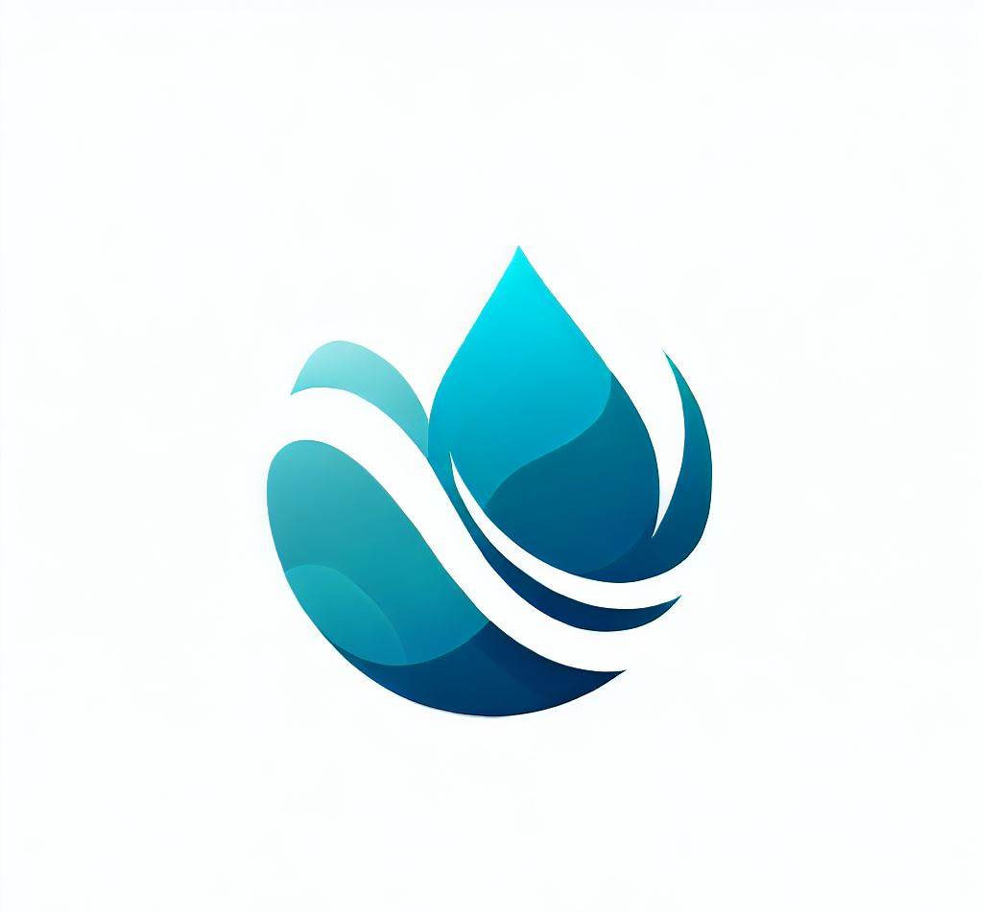

# WaterZen

# App presentation

Benvenuti in WaterZen, l'app per la gestione sostenibile dell'acqua!

WaterZen è un'app eco-friendly che ti aiuta a monitorare il tuo consumo di acqua giornaliero e a ridurre lo spreco. Grazie alla sua interfaccia intuitiva e facile da usare, potrai tenere sotto controllo il tuo consumo d'acqua e ricevere suggerimenti personalizzati per migliorare la tua sostenibilità.

L'obiettivo di WaterZen è quello di sensibilizzare le persone sull'importanza di utilizzare l'acqua in modo sostenibile e responsabile, contribuendo alla conservazione delle risorse idriche del pianeta.

Con WaterZen potrai:

- Monitorare il tuo consumo di acqua giornaliero tramite un'interfaccia facile da usare
- Ricevere notifiche in tempo reale quando il tuo consumo supera una soglia prestabilita
- Ottenere suggerimenti personalizzati per ridurre il tuo consumo d'acqua e diventare più sostenibile
- Condividere la tua esperienza con gli amici e familiari su social media
- Scoprire curiosità e informazioni interessanti sullo sfruttamento sostenibile dell'acqua

**Unisciti a noi in questa sfida per un futuro più sostenibile e scarica WaterZen oggi stesso!**

# Logo Image

